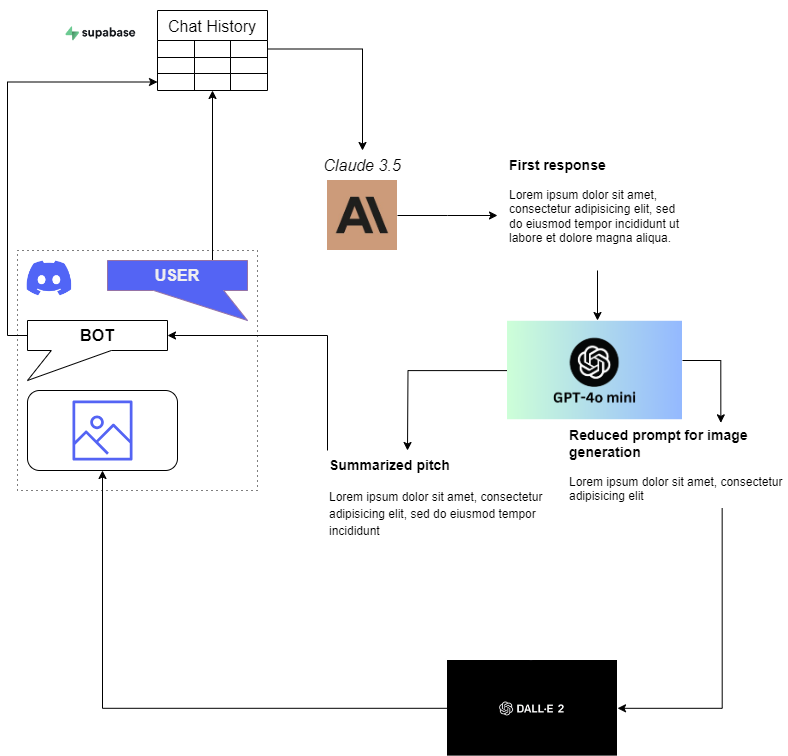

<h1 align="center">PitchGen</h1>
<h2 align="center">Brief your ideas better, with the help of AI</h2>

<div align="center">
    
   
   
   
   
   <br>
   <br>
   <div>
        
   </div>
   <br>
   <br>
</div>

## 1. Introduction
**PitchGen** is a python Discord bot aimed at easing and improving the process of generating great pitches for your great ideas. 

Leveraging Anthropic's _Claude 3.5_ and OpenAI's _GPT-4o-mini_ to create effective and impressive texts and _DALL-E 2_ to generate suggestive visualizations of the concepts, **PitchGen** gives you thorough support in the creative process for your pitches!

## 2. Installation

### 2a. Pre-requirements

Make sure that your environment has:
- `git`
- `Node v18` or following
- `npm` and `npx`
- `python 3.10` or following
- Anthropic [`api key`](https://docs.anthropic.com/en/docs/initial-setup)
- OpenAI [`api key`](https://platform.openai.com/docs/quickstart/create-and-export-an-api-key)

The installation process should work both on Windows and on Linux.

### 2b. Environment setup

First of all, clone this repository:
```bash
# BOTH Windows and Linux
git clone https://github.com/AstraBert/pitchgen-bot
cd pitchgen-bot
```

Rename `.env.example` to `.env` and paste your OpenAI and Anthropic API keys in the dedicated fields:
```bash
# BOTH Windows and Linux
mv .env.local .env
```


Get the `supabase` command line executables:

```bash
# BOTH Windows and Linux
npm install supabase
```

Create and start a Supabase instance:

```bash
# BOTH Windows and Linux
npx supabase init
npx supabase start
```

Retrieve the API URL from `API URL` and the ANON key from `anon key` that will be printed after this command:

```bash
# BOTH Windows and Linux
npx supabase status
```

Save the API URL and the ANON key respectively under the `supabase_url` and the `supabase_api_key` field in your [.env](./.env.example) file.

Create a virtual environment, activate it and install the necessary dependencies:

```bash
# Linux
python3 -m venv pitchgen
source pitchgen/bin/activate
python3 -m pip install -r requirements.txt
```

Or

```powershell
# Windows
python3 -m venv .\pitchgen
.\pitchgen\Scripts\activate  # For Command Prompt
# or
.\pitchgen\Activate.ps1  # For PowerShell
python3 -m pip install -r .\requirements.txt
```

If you wish to limit your chat history retrieval (say you want to keep only the latest 10 messages) or want to control the number of generated images (must be between 1 and 10, let's say 7), you can edit the [`.config`](./.config) file:

```
num_images=7
limit_history=10
```

### 2c. Create a Discord bot

How do you create a Discord bot? It is really simple!
1. Go to [Discord](https://discord.com/) and create an account (or log into yours, if you already have one)
2. Create a new server by clicking on "Add a server" (a big green "+" button) and name it as you want
3. Go to [Discord developers portal](https://discord.com/developers/applications) and click on "New application"
4. Name your application, than save the changes and click on "Bot", on the left
5. There you will get the chance to name your bot and copy its token: paste it under the `discord_bot` field in your [`.env`](./.env.example) file.
6. After that, go on OAuth2 > URL generator and generate a URL that you will paste in your navigation bar, to add the bot to your newly created server.
7. In the `channel_id` field in your [`.env`](./.env.example) file, insert the last number that is displayed in your server's #general channel url when you open it on the web.

### 2d. Application start
Now that the virtual python environment has been set up and activated, Supabase is running and all the secret keys are in [`.env`](./.env.example), we can finally run the bot:

```bash
python3 scripts/bot.py
```

You should see some logging and then receive a message on your server's general channel, saying that the bot is up and running. From now on, you can chat directly with the bot on Discord.

## 3. Flowchart



## 4. How to use it


There are four possibilities when messaging with the bot:

- **Direct message**: a direct message will trigger a chain of events:
    + First of all, the message will be uploaded to a Supabase table, `ChatHistory`, which will serve as storage for chat your chat history: this is managed by `ChatHistory` class in [utils.py](./scripts/utils.py). Chat history retrieval is session-based and user-based: user is defined by Discord user name (whicch should be unique) while session id is managed through the `SessionHistory` class in [utils.py](./scripts/utils.py).
    + Secondly, the entire chat history will be passed as a starting point to the "mastermind" of PitchGen, _Claude 3.5_: it will generate a first long, presentation-like pitch. This is managed by the `invoke` method in `ChatAnthropic` class in [utils.py](./scripts/utils.py).
    + Thirdly, the pitch will be summarized in two ways: the first one is optimized to produce a good image-generating prompt to pass on to DALL-E 2, the second sums up Claude's answer to return a brilliant pitch to the user. Summarization is managed by the `invoke` method in `Summarizer` class in [utils.py](./scripts/utils.py).
    + Lastly, all the image URLs are collected (managed through the the `generate_img` method in `ImageGen` class in [utils.py](./scripts/utils.py) and returned to the user.
- **!newsession** command: starts a new session history
- **!imagenum NUMBER_OF_IMAGES** command: sets the number of images to be generated ("!imagenum 3" e.g.)
- **!limithist LIMIT** command: sets the maximum number of messages to be retrieved as chat history ("!limithist 50" e.g.)

## 5. Contributions

Contributions are more than welcome! See [contribution guidelines](./CONTRIBUTING.md) for more information :)

## 6. Funding

If you found this project useful, please consider to [fund it](https://github.com/sponsors/AstraBert) and make it grow: let's support open-source together!😊

## 7. License and rights of usage

This project is provided under [MIT license](./LICENSE): it will always be open-source and free to use.

If you use this project, please cite the author: [Astra Clelia Bertelli](https://astrabert.vercel.app)
